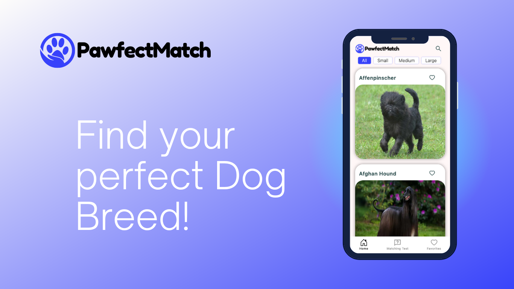

# Pawfect Match App

The Pawfect Match App is an application that helps users find the ideal dog breed based on their lifestyle, housing situation, activity level, and other preferences.

## Functionalities

The app uses a questionnaire and a matching system to determine the ideal dog breed for the user. The questions relate to various aspects such as living situation, marital status, leisure activities and much more. After the user has answered all of the questions, the matching system is used to create a list of dog breeds that best match the user's preferences.

Information such as temperament, size, maintenance requirements and much more is provided for each recommended dog breed. This allows the user to make an informed purchasing decision and ensure they are making the right choice.

## Technologies

The Pawfect Match App was developed using React, React Testing Library, Next.js, Jest, and Styled Components. The matching system uses a combination of algorithms to determine the ideal dog breed for the user. The app also utilizes Node.js, Mongoose, and MongoDB Atlas for the database and API Ninjas and useSWR for data management.

Deployed on Vercel: https://pawfect-match-app.vercel.app/

## Authors

The Pawfect Match App was developed by Lutz Dietterich.

## License

This project is licensed under the MIT License
